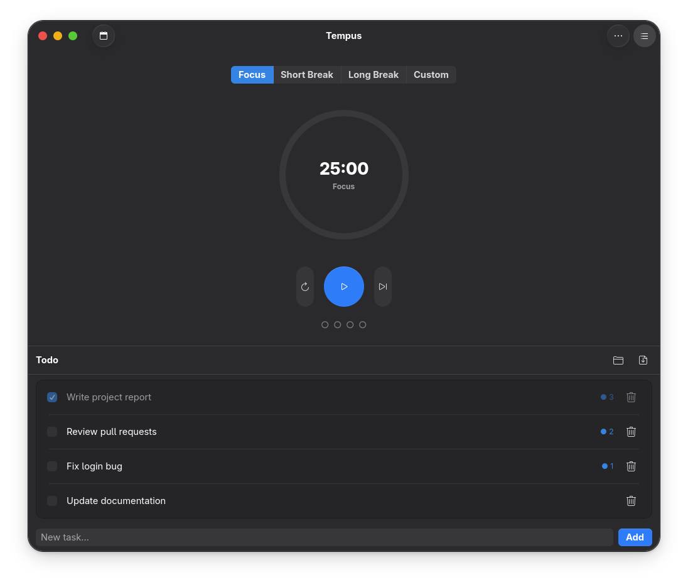
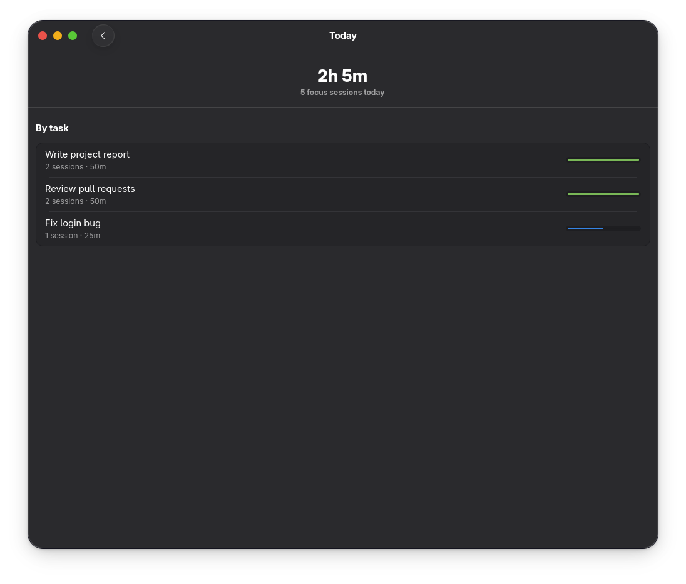
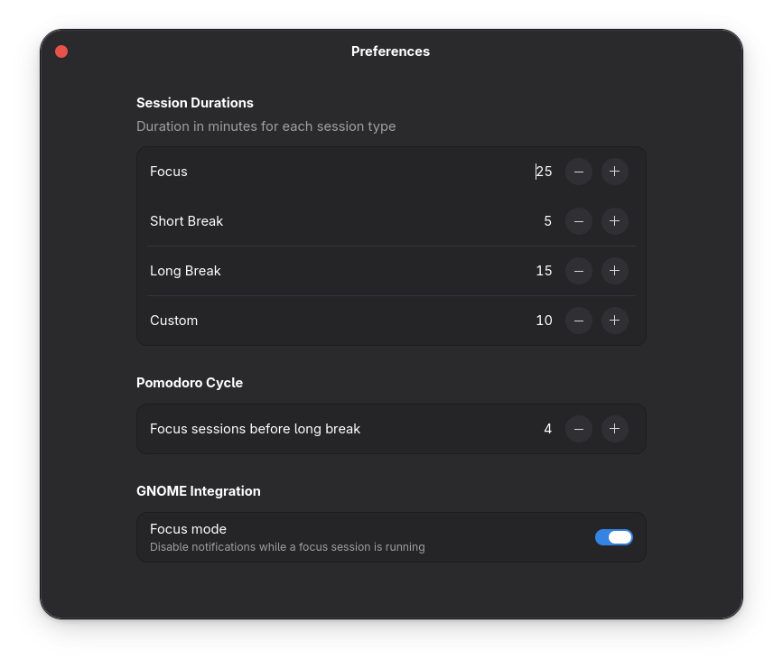

<div align="center">


# Tempus

**A focused Pomodoro timer for GNOME**

Built with GTK4 and libadwaita. Stays out of your way while you work.

[](LICENSE)
[](https://www.gnome.org/)




</div>

---

## Features

- **Four session types** — Focus, Short Break, Long Break, and Custom, each with its own configurable duration
- **Circular progress ring** — colour-coded by session type so you can tell at a glance where you are
- **Auto-cycle** — after each focus session Tempus suggests the right break and advances automatically
- **Session dots** — shows how many focus sessions you have completed in the current cycle
- **Todo list** — add tasks inline or load them from a Markdown file; export back to Markdown when done
- **Subjects** — assign a subject to any task, each with its own colour shown as a dot next to the task; add subjects on the fly or manage them and their colours in Preferences
- **Pomodoro counter per task** — each task tracks how many focus sessions have been spent on it
- **Focus history** — switch between Today, Week, Month and Semester views; Today breaks down by task, longer ranges show time per subject in matching colours so you can see exactly where your hours go
- **Semester view** — defaults to the last six months; set a custom start and end date in Preferences if your semester has fixed boundaries
- **Preferences** — change every duration and the cycle length live, no restart needed
- **Focus mode** — optionally silence GNOME notifications while a session is running
- **Sound alerts** — a sound plays when a session starts and when it ends (start sound can be turned off in Preferences)
- **Desktop notifications** — notified the moment a session ends, even if the window is minimised

<div align="center">

</div>

---

## Installation

### Flathub *(coming soon)*

```bash
flatpak install flathub io.github.EmaLica.Tempus
flatpak run io.github.EmaLica.Tempus
```

---

### Build from source

The quickest way to run Tempus without packaging it.

#### Requirements

<details>
<summary><strong>Fedora 40 / 41 / 42 / 44</strong></summary>

```bash
sudo dnf install python3-gobject gtk4 libadwaita glib2-devel
```

</details>

<details>
<summary><strong>Ubuntu / Debian / Linux Mint</strong></summary>

```bash
sudo apt install python3-gi python3-gi-cairo gir1.2-gtk-4.0 \
                 gir1.2-adw-1 libglib2.0-dev
```

</details>

<details>
<summary><strong>Arch Linux / Manjaro</strong></summary>

```bash
sudo pacman -S python-gobject gtk4 libadwaita glib2
```

</details>

#### Run

```bash
git clone https://github.com/EmaLica/Tempus
cd Tempus
chmod +x run.sh
./run.sh
```

`run.sh` compiles the GSettings schema locally and launches the app directly — no system install needed.

---

### Build and install as a local Flatpak

Use this if you want to test Tempus exactly as it will appear on Flathub, or if you want a proper desktop entry and app icon without touching your system Python.

#### Step 1 — Install the build tools

<details>
<summary><strong>Fedora 40 / 41 / 42 / 44</strong></summary>

```bash
sudo dnf install flatpak flatpak-builder
```

</details>

<details>
<summary><strong>Ubuntu / Debian</strong></summary>

```bash
sudo apt install flatpak flatpak-builder
```

</details>

<details>
<summary><strong>Arch Linux</strong></summary>

```bash
sudo pacman -S flatpak flatpak-builder
```

</details>

#### Step 2 — Add Flathub and install the GNOME runtime

This only needs to be done once per machine.

```bash
flatpak remote-add --if-not-exists flathub https://dl.flathub.org/repo/flathub.flatpakrepo
flatpak install flathub org.gnome.Platform//48 org.gnome.Sdk//48
```

> **Note:** if `48` is not yet available on your system, try `47` or run
> `flatpak remote-ls flathub | grep org.gnome.Platform` to see which versions are listed.

#### Step 3 — Clone the repository

```bash
git clone https://github.com/EmaLica/Tempus
cd Tempus
```

#### Step 4 — Build and install

```bash
flatpak-builder --user --install --force-clean build-dir flatpak/io.github.EmaLica.Tempus.yml
```

What each flag does:

| Flag | Meaning |
|---|---|
| `--user` | Installs only for your user, no `sudo` needed |
| `--install` | Installs the result right after building |
| `--force-clean` | Wipes `build-dir/` before building, avoids stale artefacts |

The first build downloads the GNOME SDK modules and can take a few minutes. Subsequent builds are cached and much faster.

#### Step 5 — Run

```bash
flatpak run io.github.EmaLica.Tempus
```

Tempus will also appear in GNOME Shell's application grid after installation.

#### Uninstall

```bash
flatpak uninstall io.github.EmaLica.Tempus
```

---

## Todo list — Markdown format

Tempus imports and exports the standard GFM task-list syntax:

```markdown
- [ ] Write the report
- [x] Review the PR
- [ ] Fix bug #42
```

Plain `- item` lines without a checkbox are imported as uncompleted tasks.

---

## Contributing

Bug reports and pull requests are welcome on the [issue tracker](https://github.com/EmaLica/Tempus/issues).

## License

Tempus is released under the [GNU General Public License v3.0](LICENSE).
