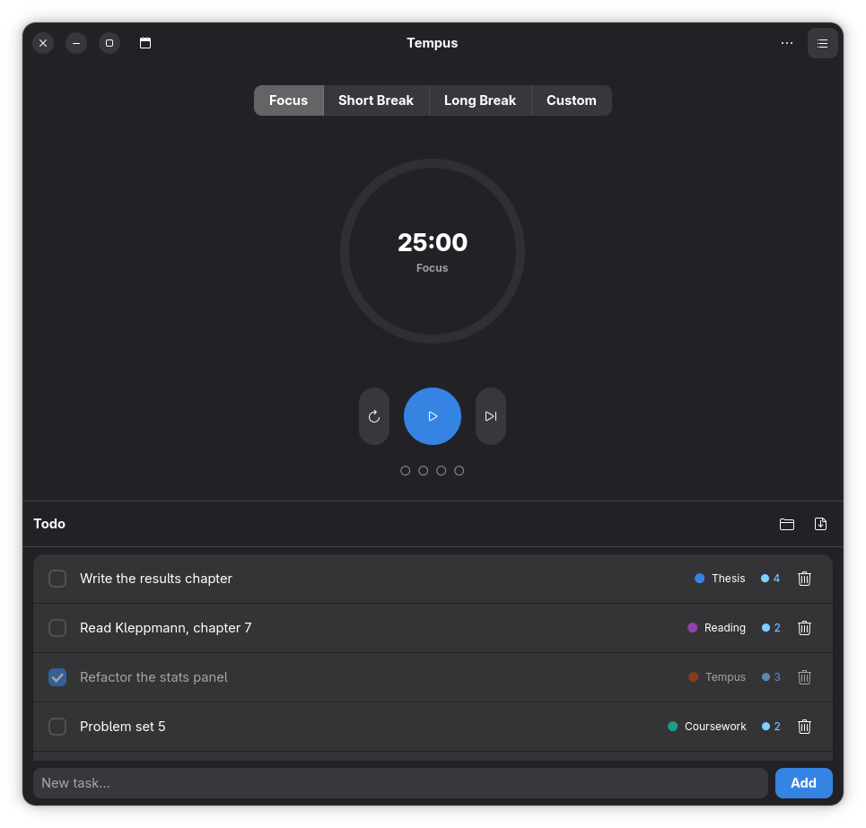
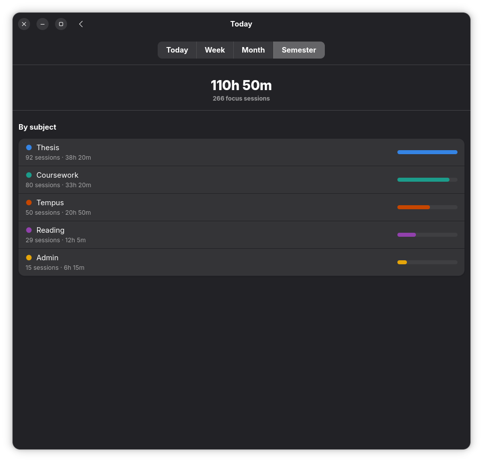
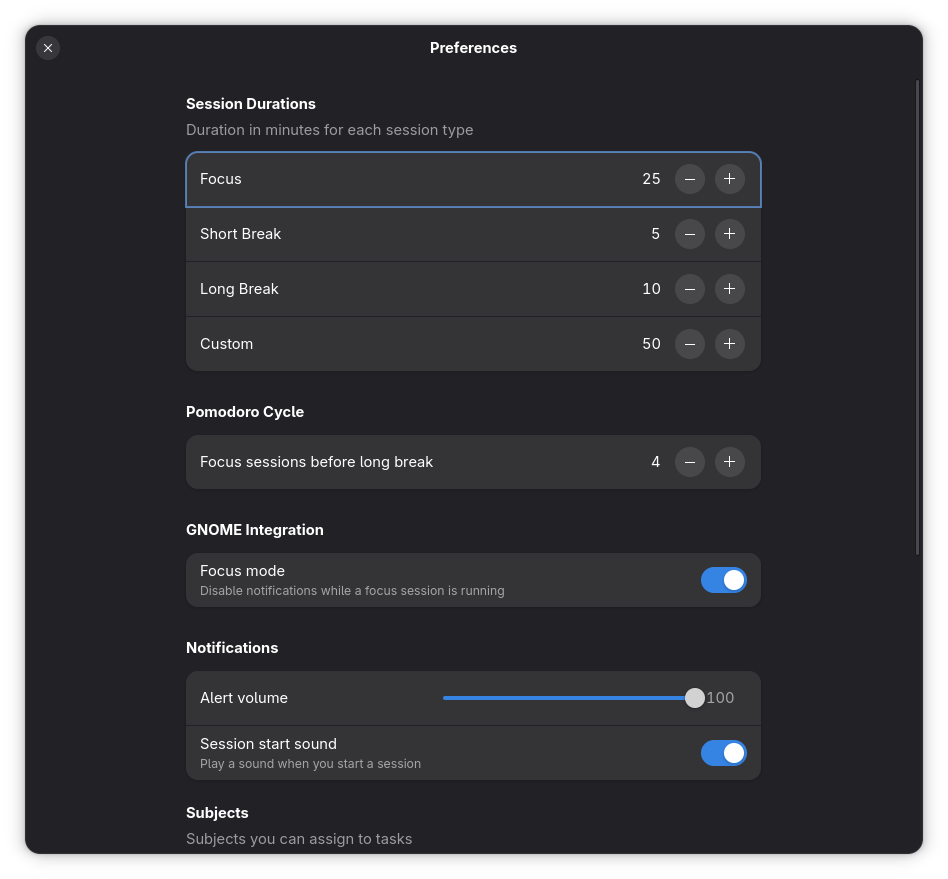
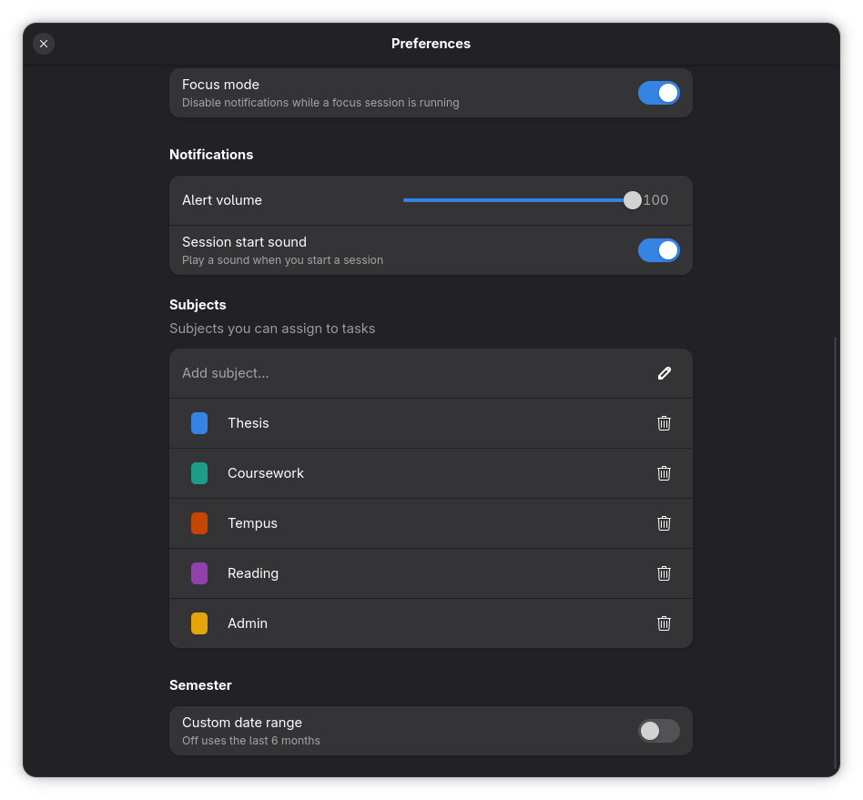
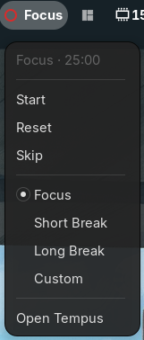
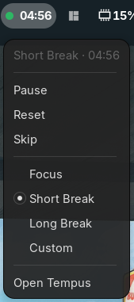

<div align="center">


# Tempus

**A Pomodoro timer for GNOME that stays out of your way.**

Focus in clean 25 minute blocks, tag what you're working on, and see exactly where your hours go. Native GTK4 and libadwaita, no clutter, no settings you'll never touch.

[](LICENSE)
[](https://www.gnome.org/)

 

</div>

---

## Features

- **Four session types.** Focus, Short Break, Long Break and Custom, each with a duration you can change on the fly.
- **A ring that shows where you are.** The progress ring is colour-coded per session type, with dots underneath counting the focus sessions in your current cycle.
- **Auto-cycle.** Finish a focus block and Tempus lines up the right break and advances on its own.
- **Todo list that sticks around.** Add tasks inline or import them from Markdown, export them back when you're done. Standard GFM checkboxes, nothing proprietary.
- **Subjects.** Tag any task with a subject like Thesis, Coursework or Reading, each with its own colour shown as a dot beside the task. Add them on the fly or manage them in Preferences.
- **Markdown that carries more than a checkbox.** An imported task can declare how many pomodoros it should take and which subject it belongs to, and any detail you indent underneath becomes its subtitle. Notes wrap to the window width instead of being cut off, so a long one stays readable.
- **Two-way sync with the source file.** Check off a task that came from a Markdown import and Tempus flips the same checkbox in the file it came from — no need to keep the list and the app in sync by hand.
- **Per-task pomodoro count.** Every task keeps a running tally of the focus sessions you've poured into it — against your estimate, when the task declares one.
- **History that actually adds up.** Flip between Today, Week, Month and Semester. Today breaks down by task, longer ranges group your time by subject in matching colours so you can see exactly where the hours went.
- **Semester view.** Defaults to the last six months, or pin a fixed start and end date if your term has real boundaries.
- **Focus mode.** Silences GNOME notifications while a session runs and restores them the moment you stop.
- **Live countdown in the window title.** Glance at the taskbar and read `12:34 · Focus` without switching back to the app.
- **GNOME Shell panel widget.** An optional top-bar indicator with a session-coloured dot and live countdown — start, pause, skip or switch session without opening the window.
- **Sound alerts with volume control.** A chime when a session starts and ends. Mute the start sound if it gets on your nerves.
- **Desktop notifications.** Pinged the moment a session ends, even with the window minimised.
- **No restart, ever.** Change any duration or the cycle length in Preferences and it applies live.

<div align="center">
 
</div>

---

## Installation

### Flathub *(coming soon)*

```bash
flatpak install flathub io.github.EmaLica.Tempus
flatpak run io.github.EmaLica.Tempus
```

---

### Build from source

The quickest way to run Tempus without packaging it.

#### Requirements

<details>
<summary><strong>Fedora 40 / 41 / 42 / 44</strong></summary>

```bash
sudo dnf install python3-gobject gtk4 libadwaita glib2-devel
```

</details>

<details>
<summary><strong>Ubuntu / Debian / Linux Mint</strong></summary>

```bash
sudo apt install python3-gi python3-gi-cairo gir1.2-gtk-4.0 \
                 gir1.2-adw-1 libglib2.0-dev
```

</details>

<details>
<summary><strong>Arch Linux / Manjaro</strong></summary>

```bash
sudo pacman -S python-gobject gtk4 libadwaita glib2
```

</details>

#### Run

```bash
git clone https://github.com/EmaLica/Tempus
cd Tempus
chmod +x run.sh
./run.sh
```

`run.sh` compiles the GSettings schema locally and launches the app directly — no system install needed.

---

### Build and install as a local Flatpak

Use this if you want to test Tempus exactly as it will appear on Flathub, or if you want a proper desktop entry and app icon without touching your system Python.

#### Step 1 — Install the build tools

<details>
<summary><strong>Fedora 40 / 41 / 42 / 44</strong></summary>

```bash
sudo dnf install flatpak flatpak-builder
```

</details>

<details>
<summary><strong>Ubuntu / Debian</strong></summary>

```bash
sudo apt install flatpak flatpak-builder
```

</details>

<details>
<summary><strong>Arch Linux</strong></summary>

```bash
sudo pacman -S flatpak flatpak-builder
```

</details>

#### Step 2 — Add Flathub and install the GNOME runtime

This only needs to be done once per machine.

```bash
flatpak remote-add --if-not-exists flathub https://dl.flathub.org/repo/flathub.flatpakrepo
flatpak install flathub org.gnome.Platform//50 org.gnome.Sdk//50
```

> **Note:** if `50` is not yet available on your system, run
> `flatpak remote-ls flathub | grep org.gnome.Platform` to see which versions are listed.

#### Step 3 — Clone the repository

```bash
git clone https://github.com/EmaLica/Tempus
cd Tempus
```

#### Step 4 — Build and install

```bash
flatpak-builder --user --install --force-clean build-dir flatpak/io.github.EmaLica.Tempus.yml
```

What each flag does:

| Flag | Meaning |
|---|---|
| `--user` | Installs only for your user, no `sudo` needed |
| `--install` | Installs the result right after building |
| `--force-clean` | Wipes `build-dir/` before building, avoids stale artefacts |

The first build downloads the GNOME SDK modules and can take a few minutes. Subsequent builds are cached and much faster.

#### Step 5 — Run

```bash
flatpak run io.github.EmaLica.Tempus
```

Tempus will also appear in GNOME Shell's application grid after installation.

#### Uninstall

```bash
flatpak uninstall io.github.EmaLica.Tempus
```

---

## GNOME Shell widget

Tempus ships an optional panel indicator that mirrors the timer in the top bar — a session-coloured dot and a live `12:34 · Focus` countdown, plus play/pause, reset, skip and session switching, without switching back to the window. It talks to the running app over D-Bus, so it stays in sync while Tempus is open; close the app and the indicator dims, click it to launch Tempus again.

<div align="center">
 
</div>

```bash
ln -s "$PWD/shell-extension" \
  ~/.local/share/gnome-shell/extensions/tempus@emalica.github.io
gnome-extensions enable tempus@emalica.github.io
```

On Wayland, log out and back in first so the shell picks up the new extension. Full details in [`shell-extension/INSTALL.md`](shell-extension/INSTALL.md).

---

## Todo list — Markdown format

Tempus imports and exports the standard GFM task-list syntax:

```markdown
- [ ] Write the report
- [x] Review the PR
- [ ] Fix bug #42
```

Plain `- item` lines without a checkbox are imported as uncompleted tasks.

### Notes

Indented lines under a task become its subtitle, so the row stays readable no
matter how much detail the note carries:

```markdown
- [ ] Rewrite the parser
  Split the prefix off the title first.
  - the old regex swallowed the whole line
```

A blank line closes the note. An indented checkbox is a task of its own, not a
note.

Notes are never truncated: they wrap over as many lines as they need, reflowing
when you resize the window. Titles behave the same way, so nothing is hidden
behind an ellipsis — keep titles short if you want compact rows.

### Estimates and subjects

A task can declare how many pomodoros it should take, and Tempus tracks progress
against it — the badge reads `● 2/5` instead of `● 2`:

```markdown
- [ ] [5🍅] Write the report
```

An optional keyword after the count is carried through untouched on export, so
tags your notes rely on survive a round trip:

```markdown
- [ ] [5🍅 alpha] Write the report
```

Subjects are picked up from the surrounding headings. A task inherits the last
heading that names one of the subjects you already created in the app — matching
ignores emoji, case and punctuation, so `## 📐 Mat. Continuo — limits` assigns
*Mat. Continuo*:

```markdown
## 📐 Mat. Continuo — limits
- [ ] [2🍅] Sequences

## Anything else
- [ ] [1🍅] Mat. Continuo: extra exercises
```

Under a heading that matches nothing, Tempus looks for a subject name in the task
text itself — the second task above still lands on *Mat. Continuo*. Subjects are
never created by an import: unknown names are left unassigned.

Importing replaces the whole list, so keep one file per batch of tasks.

### Two-way sync

Checking a task off in Tempus writes the same change back to the Markdown file
it was imported from — `- [ ]` becomes `- [x]` right where the task lives, so
the file on disk never falls behind the app:

```markdown
- [ ] [2🍅 alpha] Write the report
```

becomes

```markdown
- [x] [2🍅 alpha] Write the report
```

This only applies to tasks imported from a real checkbox. Plain `- item`
bullets and tasks added directly in Tempus have no file to sync back to. If
the source file was edited or moved since the import, Tempus looks for a line
with matching text before giving up.

---

## Contributing

Bug reports and pull requests are welcome on the [issue tracker](https://github.com/EmaLica/Tempus/issues).

## License

Tempus is released under the [GNU General Public License v3.0](LICENSE).
